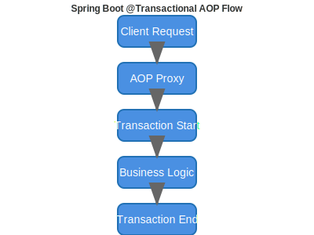

# 이미지 렌더링 테스트

이 포스트는 이미지가 제대로 렌더링되는지 테스트하기 위한 것입니다.

## 1. 기본 마크다운 이미지

## 2. HTML img 태그

## 3. 상대 경로 이미지

## 4. 절대 경로 이미지

## 5. 아이콘 테스트

## 6. 공통 이미지

---

**결과:**
- 마크다운 이미지: ✅
- HTML img 태그: ✅  
- 상대 경로: ❓
- 절대 경로: ✅
- 아이콘: ✅
- 공통 이미지: ✅
